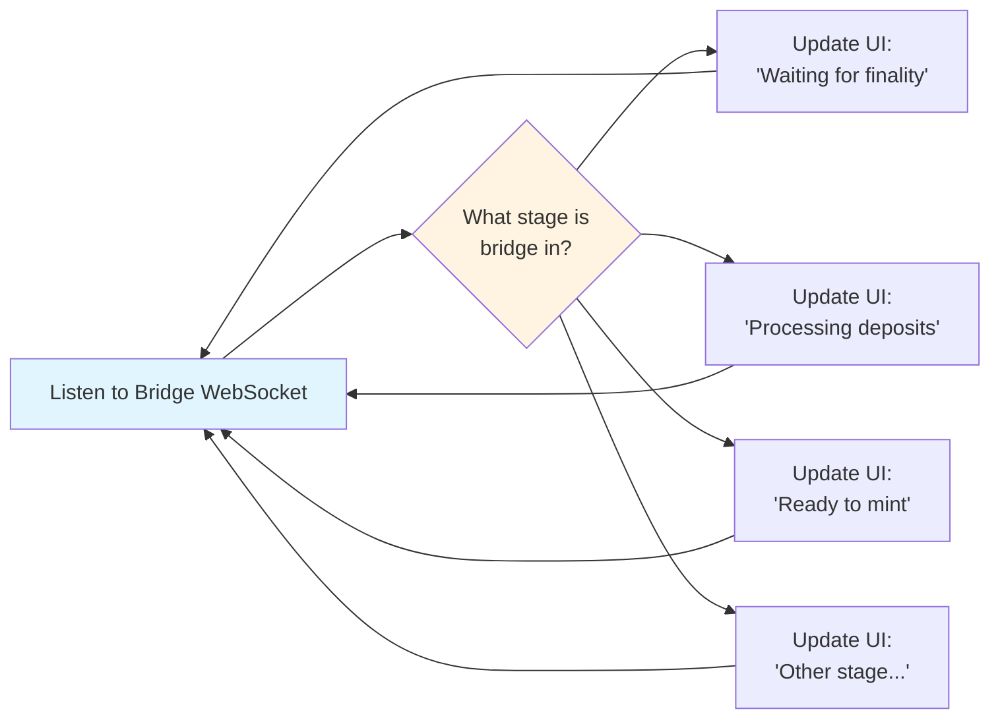
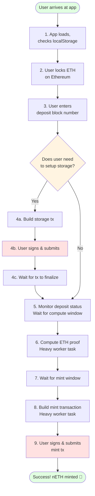
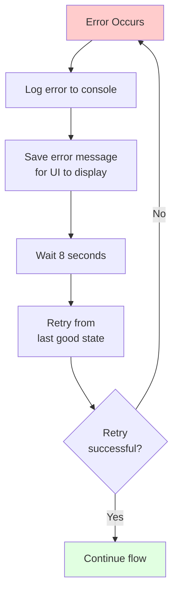
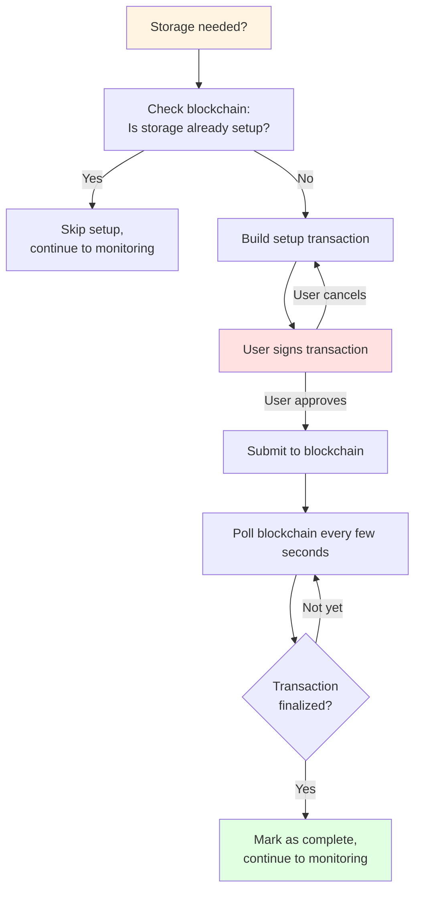

# Simple High-Level Flow Diagrams

## BridgeMachine - What It Does

**Purpose:** Tells the UI what stage the overall bridge system is in.



**That's it!** It just mirrors the bridge state to your UI.

---

## DepositMintMachine - User Journey (Happy Path)



---

## What Happens at Each Step

### Step 1: App Loads
- Checks localStorage for any in-progress deposit
- If found, resumes from where user left off

### Step 2: User Locks ETH
- User interacts with Ethereum contract (outside this machine)
- Gets a deposit block number

### Step 3: Enter Deposit Number
- User tells the machine which deposit to track
- Machine starts monitoring that deposit

### Step 4: Storage Setup (Only if needed)
**4a. Build Transaction**
- Worker compiles contracts
- Creates a setup transaction

**4b. User Signs**
- Wallet pops up (Auro wallet for Mina)
- User approves transaction

**4c. Wait for Finalization**
- Machine polls blockchain until confirmed
- Usually takes a few minutes

### Step 5: Monitor Deposit
- Machine watches bridge status
- Waiting for Ethereum finality (13+ minutes)
- Then waiting for deposit to be processed

### Step 6: Compute ETH Proof
- Heavy cryptographic computation
- Runs in background worker (so UI doesn't freeze)
- Proof saved to localStorage

### Step 7: Wait for Mint Window
- Bridge has specific timing windows
- Machine waits until "ReadyToMint" signal

### Step 8: Build Mint Transaction
- Worker builds the final minting transaction
- Includes the ETH proof from step 6

### Step 9: Submit Mint
- User signs transaction with wallet
- Transaction submitted to Mina blockchain
- Success! User now has nETH

---

## What Can Go Wrong (Error Handling)



**Error Recovery:**
- Machine automatically retries after 8 seconds
- All progress saved to localStorage
- User can refresh page - flow resumes

---

## The Storage Setup Flow (Detailed)



---

## Key Takeaways

### BridgeMachine
- **Super simple**: Just monitors bridge state
- **No user interaction**: Fully automatic
- **Updates UI**: Shows global bridge status

### DepositMintMachine
- **Complex flow**: 9 main steps for user
- **2 user interactions**: Sign storage setup (maybe), sign mint tx (always)
- **Automatic retry**: Errors handled gracefully
- **Resumable**: Can refresh page anytime

### Both Together
```
┌─────────────────────────────────────┐
│  BridgeMachine (Global)             │
│  "Bridge is processing deposits"    │ ← Background info
└─────────────────────────────────────┘

┌─────────────────────────────────────┐
│  DepositMintMachine (Your Deposit)  │
│  Step 5 of 9: Monitoring deposit... │ ← Your progress
│  [Progress bar: 55%]                 │
└─────────────────────────────────────┘
```

---

## Simplification Opportunities

### Current: 17 states
```
hydrating → checking → noActiveDepositNumber → hasActiveDepositNumber →
needsToCheckSetup → setupStorageOnChainCheck → setupStorage →
submitSetupStorageTx → waitForStorageSetupFinalization →
monitoringDepositStatus → computeEthProof → hasComputedEthProof →
buildingMintTx → submittingMintTx → (checkingDelay) →
(completed/missedOpportunity)
```

### Proposed: 9 states
```
init → enterDeposit → setupStorage → monitoring →
computingProof → buildingTx → submitting → completed
(+ error state)
```

**Why so many states currently?**
- Storage setup broken into 5 states (could be 1-2)
- Separate "has proof" waiting state (could combine with building)
- Checking and hydrating separate (could combine)
- Error delay as its own state (could be a timer in error state)

The core user flow is really just **9 steps**, but the implementation uses **17 states** to manage all the edge cases and persistence.
